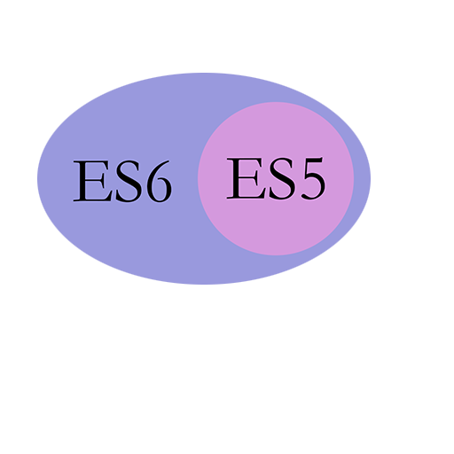

## ES6简介
- 全称ECMAScript 5
- 发布时间：2015年6月
- 目标：使JavaScript语言能够编写大型的应用程序，成为企业级开发语言
- ES5.1（2011年，只修改了一点点）
- ES4（想法太过于激进而夭折）
- ES3（1999年，现在js的核心都来自这里）

### 关系

## 参考
- [阮一峰ES6入门](http://es6.ruanyifeng.com/)
- [ES6新特性列表](https://frankfang.github.io/es-6-tutorials/)