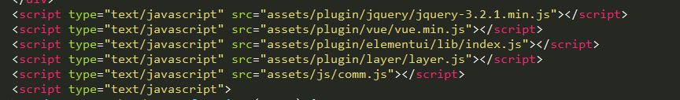

## 模块
> JavaScript这门语言，在设计之初是没有自己的模块系统的，但是其他语言都有这项功能，如Ruby的`require`、Python的`import`，所以对开发大型的项目形成了巨大的障碍。

### ES5的中的模块系统

- 所有的代码写在一个文件中，按照依赖顺序，被依赖的方法必须写在前面。但是存在很多问题
    - 代码可复用性不高
    - 代码可读性差
    - 单个文件会越来越大，后期命名困难


- 按照功能将代码拆分为不同文件，按照依赖顺序加载，被依赖的方法必须先加载。通用代码可以复用，但是问题还是很多
    - 过多全局变量，容易冲突
    - 过多javascript脚本加载导致页面阻塞
    - 过多依赖不方便管理和开发

但是在ES6正式发布之前，社区中已经制定了一些模块加载的方案，最主要的有CommonJS和AMD两种。前者用于服务器，后者用于浏览器。

### ES6模块
> 取代了CommonJS和AMD规范，成为了浏览器和服务器通用的模块解决方案。其模块功能主要由两个命令构成：`export`和`import`。`export`用于规定模块的对外接口，`import`命令用于输入其他模块提供的功能。

#### export
一个模块就是一个独立的文件。该文件内部所有的变量，外部无法获取。如果你希望外部能够读取模块内部的某个变量，就必须使用`export`关键字输出该变量。

- 基本用法

```js
// profile.js
let firstName = 'Lili'
let lastName = 'haha'
let year = 1985

function v1(){ ... }

export {
    firstName, 
    lastName, 
    year,
    v1 as functionV1
}
```

- `export default`为模块制定默认输出

```js
// export-default.js
function foo() {
  console.log('foo');
}

export default foo
```

其他模块引入该模块时，`import`命令可以为该匿名函数指定任意名字

```js
// import-default.js
import customName from './export-default';
customName(); // 'foo'
```

#### import
> 使用`export`命令定义了模块的对外接口以后，其他JS文件就可以通过`import`命令加载这个模块。


```js
// main.js
import {firstName, lastName, year} from './profile.js';

function setName(element) {
  element.textContent = firstName + ' ' + lastName;
}

// 上面的import可以改为整体加载
import * as Person from './profile.js'

console.log(Person.firstName)
```
注意：`import`命令输入的变量都是只读的，因为它的本质是输入接口，也就是说，不允许在加载的模块中改写接口。

```js
// 错误写法
import {a} from './xxx.js'

a = {}; // Syntax Error : 'a' is read-only;

// 如果a是一个对象，可以改写其属性
import {a} from './xxx.js'

a.foo = 'hello'; // 合法操作
```