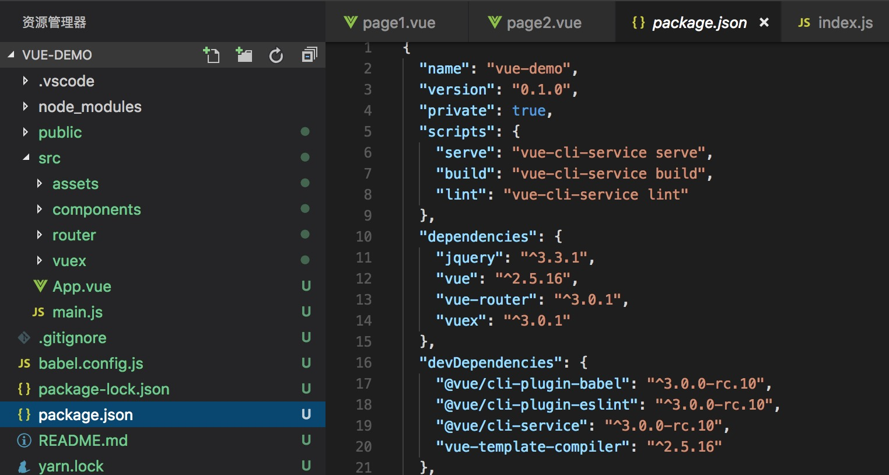

## vue-cli
> 基于webpack，它会自动帮你生成好项目目录，配置好webpack，以及各种依赖包工具。

### 起步
```js
npm install -g @vue-cli
// or
yarn global add @vue-cli

vue create my-project

cd my-project

// vue-cli 3.0
npm run serve

// vue-cli 2.x
npm run dev
```

### 一个通过vue-cli构建的项目结构


